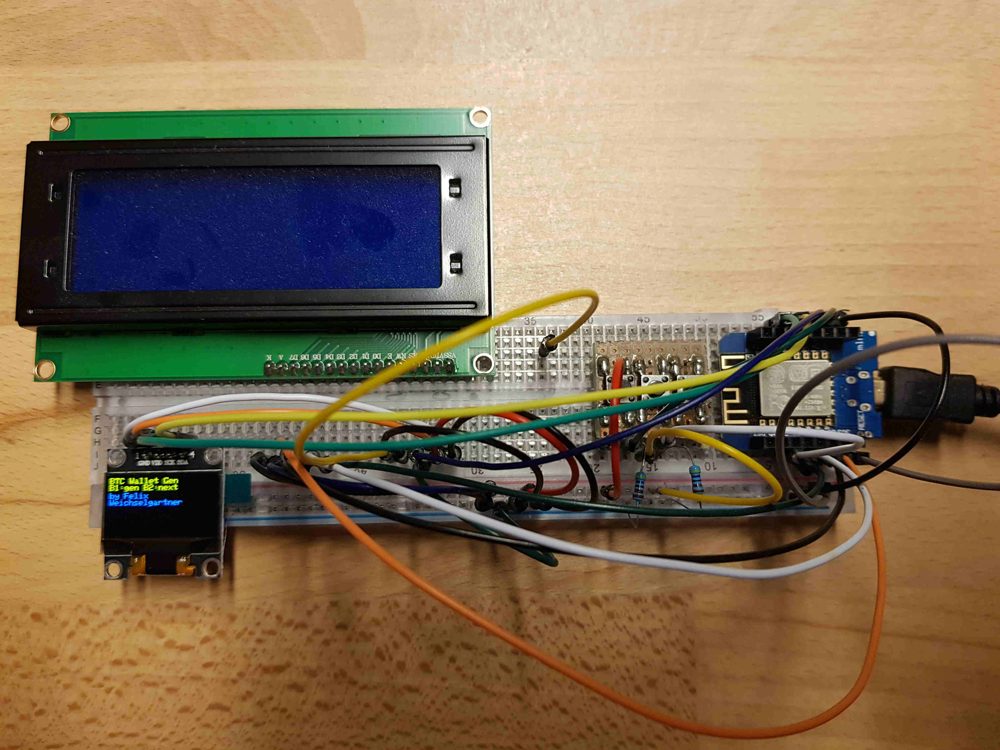
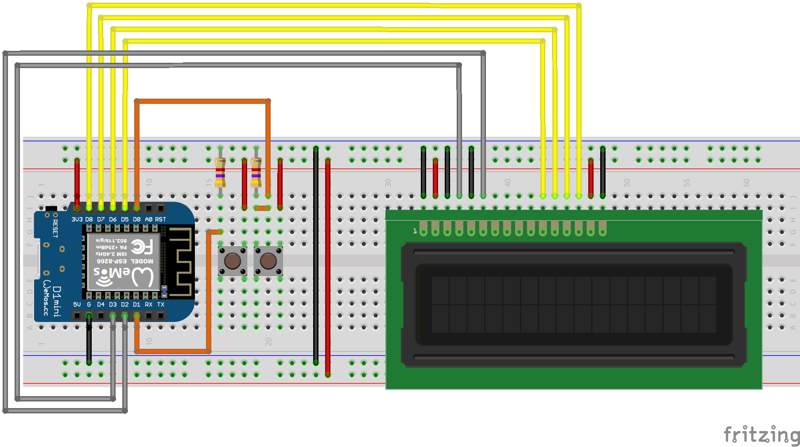
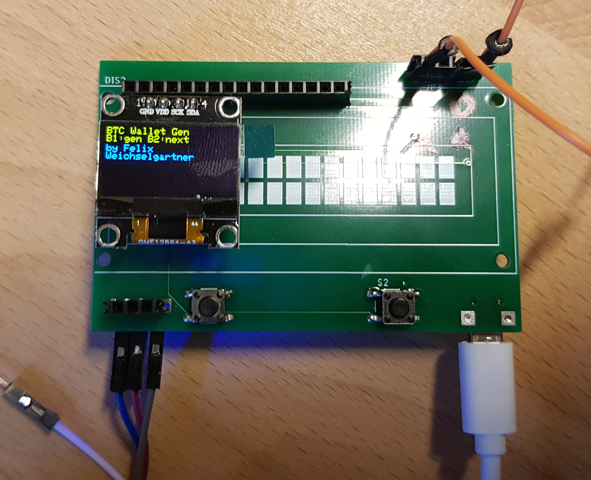
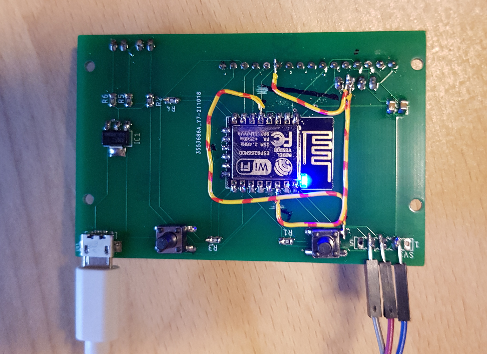

# Bitcoin Offline Paper-Wallet Generator

You ever felt unsave creating a Bitcoin wallet on your desktop computer or on your smartphone? As such devices are often connected to the internet there might be a chance you have already been hacked and somebody could be stealing your private key(s). The solution is to create your private keys on a device that cannot be hacked, because it is not connected to any other devices (e.g. no internet, ...). 

This projects aims for a microcontroller based private key generation. The private key will be generated using rng. Your bitcoin address will then be calculated from your private key. Both will then be displayed on a display, for you to transfer on a piece of paper, which you will keep save. You can now use the address to transfer your bitcoins. Once you need your bitcoins, you simply import your private key in a wallet program and for savety reasons create a new paper wallet with this device. You can then use the bitcoins you need and transfer the rest to your new save bitcoin address.

## Work in progress

Only use this project at your own risk. I am not responsible for your usage of this code. Furthermore, do not send bitcoins to any addresses in this repo.

## Breadboard testbench

## PCB

Click [here](documentation/flash_pcb.md) to see how to flash a pcb.

The wires are for my revision 1 board and are already fixed in the schematic.

## RNG tests

Click [here](tests/rng_validation/TEST.md) to see the RNG tests.

## Dependencies

You can download all neccessary firmware libraries by executing `sh firmware/lib/download.sh`.

Firmware:
* https://github.com/micro-bitcoin/uBitcoin (MIT)
* https://github.com/marvinroger/ESP8266TrueRandom.git (LGPL-3.0 if ESP8266 is used)
* https://github.com/adafruit/Adafruit_BusIO (MIT, for SSD1306 display)
* https://github.com/adafruit/Adafruit-GFX-Library (BSD, for SSD1306 display)
* https://github.com/adafruit/Adafruit_SSD1306 (BSD, for SSD1306 display)

Only for address validation:
* https://github.com/PaulGregor/Bitcoin-Keys-Generator (GPL-3.0)

## License

This project is licensed under `gnu-gpl-v3.0`. See `License.txt` for more information.
