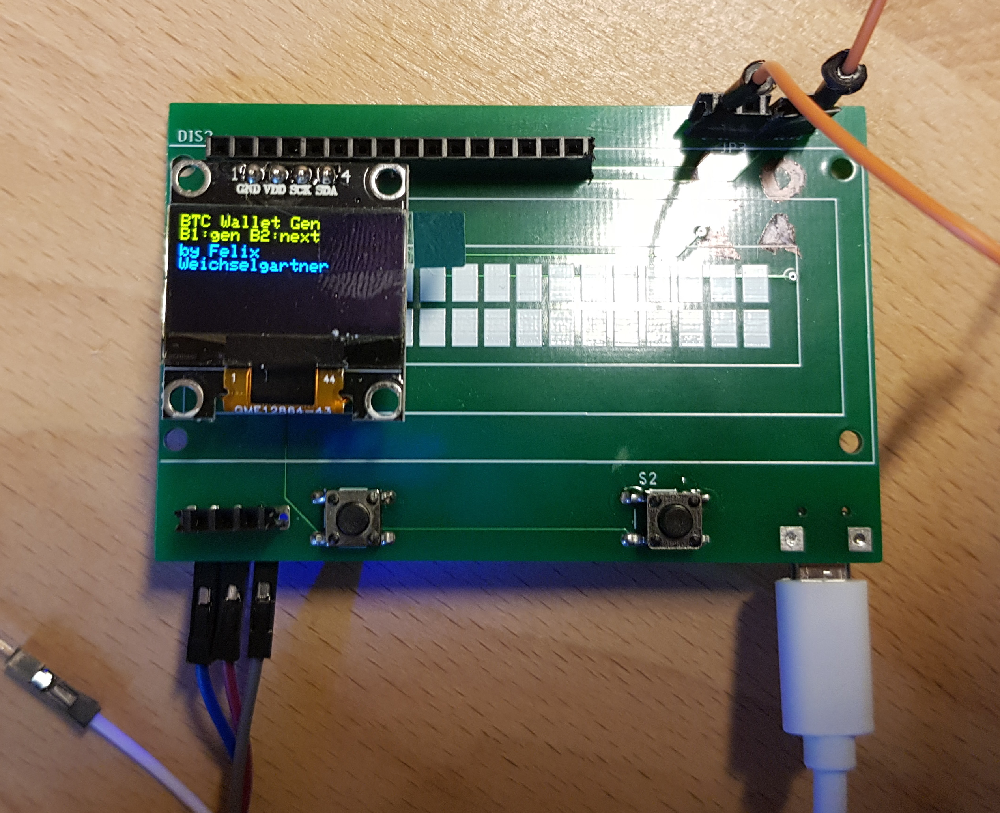
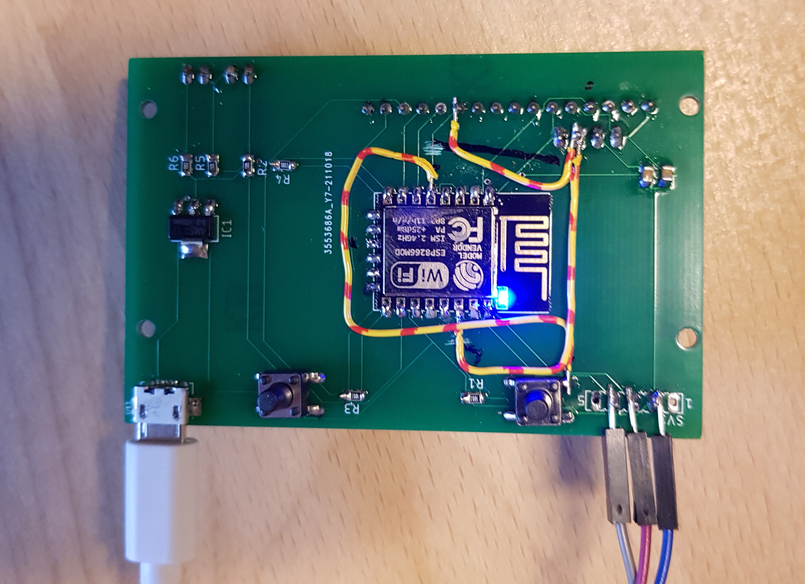

# How to flash a pcb

Here is a preview of the pcbs. You can choose between a lcd and a led display.

In the top right you see two orange wires. The right wire is connected to GPIO0 and the left one to RESET. With the jumpers you can connect both pins to GND.

If you use the lcd display, it is not possible to connect the ftdi-programmer to the jumpers. I simply soldered them to the back.

The wires are for my revision 1 board and are already fixed in the schematic.

# Steps for uploading

* Connect your FTDI-Breakout board according to the schematic
* Connect GPIO0 with the jumper to GND
* Connect RST with the jumper to GND
* Disconnect RST with the jumper from GND
* The built-in led should have turned off
* Now the ESP-12E module should be in programming mode
* 
    * Choose these settings
* Press upload
* Disconnect GPIO0 with the jumper from GND
* Connect RST with the jumper to GND
* Disconnect RST with the jumper from GND
* The program should be running now
