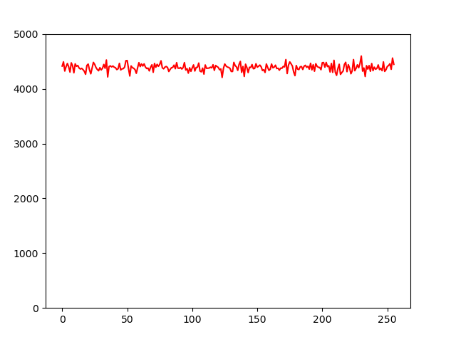

# Here are some information on the RNG

Here you can verify the random number generation. Before you use the system make sure you understand how the numbers are generated and whether you agree with the process. I'm not an expert in random number generation and it might be possible that there is an obvious mistake that others can abuse to generate similar numbers to yours, which might lead to generating the same private key. I am not responsible if your private key gets reproduced!

## ESP8266

Random number generation for the ESP8266 is done with https://github.com/marvinroger/ESP8266TrueRandom.git. I did not verify if the random number are truly random, i.e. that they dont repeat with a given seed. However, I did test the distribution of the random numbers:

This is fine as only about 100'000 numbers are tested.

## STM32

Not tested so far.

## All tested microcontrollers

You can check the amount of samples and the actual numbers for each value from 0 to 255 in the file: `output.txt`.

## Reproduce this yourself

You can use the rng_test sketch to print random numbers to the serial monitor. Then press `Ctrl + a` to select everything and copy it to a text file. Then include the text file in `test.py`.

## TODO:

Once could use the random generated numbers and check for patterns in the generations, e.g. to cehck for repeating numbers to check that there is actual true random number generation.
